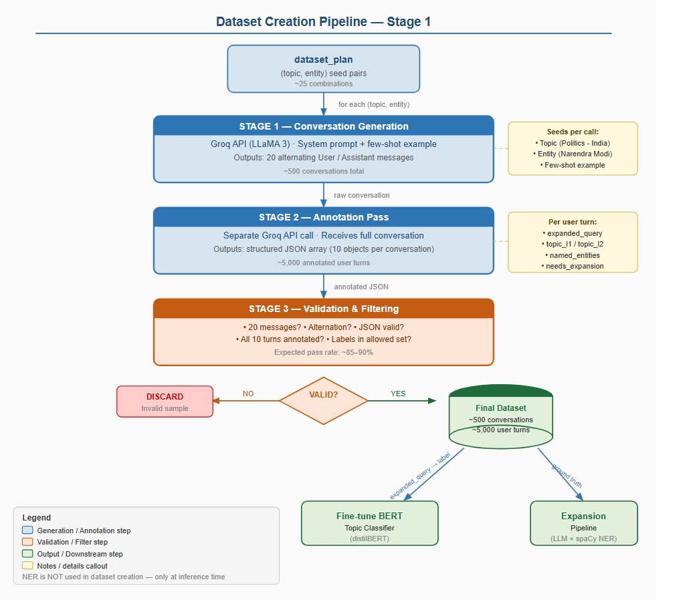

# Real-Time Query Expansion & Topic Tagging — Backend Pipeline

> **Live demo →** [streamlit app](https://gsdtepaqrm57qwsoqzz4qu.streamlit.app/)  
> **Frontend repo →** [Real-Time-Query_Expansion_amd_Topic-Tagging](https://github.com/DeityAG/Real-Time-Query_Expansion_amd_Topic-Tagging/tree/main)  
> **Models on HuggingFace →** [L1 classifier](https://huggingface.co/Adignite/query-topic-l1-classifier/tree/main) · [L2 classifier](https://huggingface.co/Adignite/query-topic-l2-classifier)  
> **Dataset Creation →**[Colab 1](https://colab.research.google.com/drive/19faugY8dz_BTmNGw0hKpHnvibGBOGBak?usp=sharing)  
> **Bert Classifier →**[Colab 2](https://colab.research.google.com/drive/1P0fa2K3EOrLzw1T-E0fzUikQRAzHnJa0?usp=sharing)  
> **FULL-INFERENCE-Expansion →**[Colab 3](https://colab.research.google.com/drive/1mEkwahpPU_dU1vK_HWDXDFxEECaRtrTq?usp=sharing)  

---

## What this does

For every user message in a multi-turn conversation, the pipeline does two things in real time:

1. **Query Expansion** — rewrites the user message into a fully self-contained question by resolving pronouns, ellipsis, and implicit references using the last 20 messages of conversation history.
2. **Topic Classification** — assigns a 2-level hierarchical label (e.g., `Politics > India`) to the (expanded) message using a fine-tuned DistilBERT classifier.

```
User message
     │
     ├─► Sliding window (last 20 messages)
     │
     ├─► spaCy NER  ──►  Entity Register  (PERSON, GPE, ORG, EVENT)
     │
     ├─► Interruption detector  ──►  tag GENERAL, skip expansion
     │
     ├─► LLM rewriting  (Llama-3.2-1B-Instruct via HuggingFace)
     │       context + entity register  ──►  expanded query
     │
     └─► DistilBERT classifiers  ──►  [L1 topic]  [L2 topic]
```

---

## Repository structure

```
├── dataset_groq.ipynb          # Stage 1 — synthetic dataset generation via Groq API
├── merge_and_dedup.ipynb       # Stage 2 — merge CSVs, deduplicate (exact + BLEU)
├── bert_classifier.ipynb       # Stage 3 — DistilBERT fine-tuning (L1 + L2)
├── expansion_pipeline_FULL_INFERENCE.ipynb   # Stage 4 — full inference pipeline
├── merged_conversations.csv    # Final conversation-level dataset (277 conversations)
├── turns_dataset.csv           # Final turn-level dataset (2,046 turns, BERT-ready)
└── dataset_hf.ipynb            # (Unused) HuggingFace-hosted model generation attempt
```

> `dataset_hf.ipynb` was an early attempt to generate data using a locally-loaded HuggingFace model (Qwen3-14B). It was abandoned due to generation speed — the Groq API pipeline (`dataset_groq.ipynb`) was used instead for all final data.

---

## Pipeline walkthrough



### Stage 1 — Dataset generation (`dataset_groq.ipynb`)

Synthetic conversations are generated using the **Groq API** (`llama-4-scout-17b-16e-instruct`) via a 3-stage prompting framework:

| Stage | What happens |
|---|---|
| **Stage 1** | LLM generates a 20-message alternating User/Assistant conversation seeded by a topic + entity pair |
| **Stage 2** | A separate LLM call annotates every user turn: expanded query, topic labels, named entities, `needs_expansion` flag |
| **Stage 3** | Python validation checks turn count, JSON structure, label conformance; rejects failures |

34 seed `(topic_l1, topic_l2, entity)` pairs are repeated to target 500 conversations. The pipeline saves a checkpoint every 50 samples and retries API failures up to 3 times.

### Stage 2 — Merge & deduplication (`merge_and_dedup.ipynb`)

Three CSV files generated across separate pipeline runs (with slightly different prompts and model versions) are merged and deduplicated at two levels:

- **Conversation level** — fingerprint via first-3-user-query exact match; keep highest-priority version
- **Turn level** — exact string match, then bigram BLEU ≥ 0.85 within the same topic label

See [`DATASET_README.md`](DATASET_README.md) for full dataset details.

### Stage 3 — Model training (`bert_classifier.ipynb`)

Two DistilBERT classifiers are fine-tuned independently on `expanded_query` as input text:
- **L1 classifier** — 8 coarse domain classes
- **L2 classifier** — 19 fine-grained sub-topic classes

See [`MODEL_README.md`](MODEL_README.md) for architecture, training config, and evaluation results.

### Stage 4 — Inference pipeline (`expansion_pipeline_FULL_INFERENCE.ipynb`)

The full end-to-end real-time system:

- **spaCy NER** (`en_core_web_trf`) extracts PERSON, GPE, ORG, EVENT, NORP entities from both user and assistant turns into a sliding-window **Entity Register**
- An **interruption detector** (regex + word-count heuristics) catches small-talk and fillers — these are tagged `General > General` and returned as-is without LLM expansion
- **Llama-3.2-1B-Instruct** (HuggingFace) rewrites the user message using the conversation history window and entity register
- The expanded query is passed to both **DistilBERT classifiers** for L1 and L2 topic tags

---

## Quick start

```bash
pip install transformers accelerate spacy torch groq pandas scikit-learn nltk
python -m spacy download en_core_web_trf
```

Load the classifiers directly from HuggingFace:

```python
from transformers import pipeline

clf_l1 = pipeline("text-classification", model="Adignite/query-topic-l1-classifier")
clf_l2 = pipeline("text-classification", model="Adignite/query-topic-l2-classifier")

query = "what are his responsibilities as prime minister?"
print(clf_l1(query))   # [{'label': 'Politics', 'score': 0.97}]
print(clf_l2(query))   # [{'label': 'India', 'score': 0.94}]
```

For the full expansion + classification pipeline, run `expansion_pipeline_FULL_INFERENCE.ipynb` end-to-end. Set your HuggingFace token in the config cell.

---

## Topic hierarchy

| L1 (Domain) | L2 Sub-topics |
|---|---|
| Politics | India, UK, USA |
| Sports | Cricket, Football, Tennis, Olympics |
| Technology | AI, Space, Gadgets |
| Entertainment | Bollywood, Hollywood |
| Health | Nutrition, Mental Health, Fitness |
| History | India, World Wars |
| Geography | Countries, Cities |
| General | General (small talk, interruptions, fillers) |

---

## Key design decisions

**Why LLM-generated data?** No existing dataset covers multi-turn conversational query expansion with ellipsis and pronoun resolution at this granularity. LLM generation with the 3-stage prompting framework is more practical than manual annotation at scale.

**Why DistilBERT over BERT-base or RoBERTa?** 40% smaller, 60% faster, retains 97% of BERT-base performance. The classification task (8 L1 classes, ~1.6k training examples) doesn't justify the overhead of a larger model.

**Why separate L1 and L2 classifiers?** Keeping them independent allows each to optimise for its label granularity. L2 has 19 classes vs L1's 8, and the feature boundaries differ enough that a single multi-output head would underperform.

**Why NER at inference but not at dataset creation?** The LLM annotator already understands context and can extract implicit references that spaCy would miss in raw text. spaCy NER is reserved for real-time use where no ground-truth context exists.
